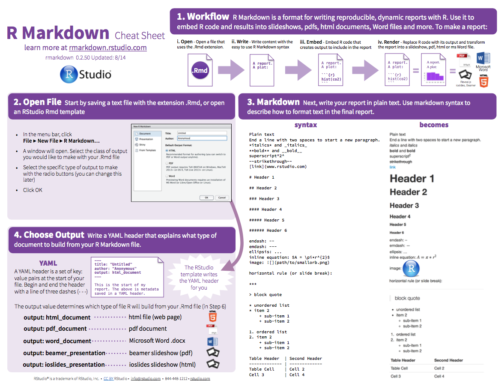
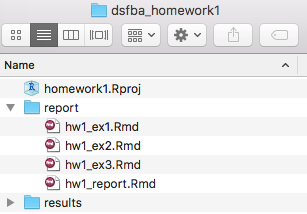

[Download the HW1 skeleton files](https://raw.githubusercontent.com/tvatter/dsfba_2018/master/data/dsfba_homework1_skeleton.zip). To successfully complete the first assignment you
will have to do the following:

1. Create a new project with the name `homework1.Rproj`.
2. Organize the files in the right folders to provide ease of building a final
`HW1_report.Rmd` = `hw1_ex1.Rmd` + `hw1_ex2.Rmd` + `hw1_ex3.Rmd`.
3. Following the instructions below, complete missing code in chunks in `hw1_ex1.Rmd`, `hw1_ex2.Rmd` and `hw1_ex3.Rmd`. 


To obtain the maximum number of points, use whenever possible:

* the pipeline symbol `%>%`,
* `dplyr` verbs (see below),
* `kable` to print tables,
* `ggplot` to produce the figures.


| verb | description |
| :---  | :---  | :---:  |
| `select()` | select columns |
| `filter()` | filter rows |
| `arrange()` | re-order or arrange rows |
| `mutate()` | create new columns |
| `summarise()` | summarise values |
| `group_by()` | group operations |

#### Revise writing report using RMarkdown




<!-- __Q1.__ To showcase your successful project organisation, start your report by -->
<!-- providing the code and output for listing all files in your current directory  -->
<!-- and subdirectories. -->

#### Data transformation hands-on

Once you're environment is set up, you're ready to get your hands dirty with 
some data manipulation. Following the instructions provided in "R workflow and
RMarkdown", you should be able to solve the following assignments:

 * Exercise 1: Setup
 * Exercise 2: Motor Trend Car Road Tests
 * Exercise 3: Airquality


Begin by writing your code in the corresponding code chuncks in `hw1_ex1.Rmd`,
`hw1_ex2.Rmd` and `hw1_ex3.Rmd`. When you finish the three exercises, use `Knitr` to render the
full report `HW1_report.Rmd`.
Don't forget to save your files and keep them ready and clean for the next session. 


#### Exercise 1: Setup

__Project Setup 'homework1.Rproj'__

Use the files provided in `dsfba_homework1.zip` to structure your project in the following way (you should create subdirectories by yourselves):



__1.a__ Install the tidyverse and knitr.

__1.b__ Load the tidyverse, knitr, and set the precision to 2 digits.

#### Exercise 2: Motor Trend Car Road Tests

In this exercise, you will use the `mtcars` dataset from the `datasets` package. The data was extracted from the 1974 Motor Trend US magazine, and comprises fuel consumption and 10 aspects of automobile design and performance for 32 automobiles (1973–74 models).

__2.a__ Load the dataset mtcars. How many observations and variables does this dataset have?

__2.b__ Print out the mtcars data frame sorted by hp (descending order).

__2.c__ Create a new object named `cars_cyl` and assign to it the `mtcars` data frame grouped by the number of cylinders.

__2.d__ Modify `cars_cyl` to remove all variables except the average miles/(US) gallon and gross horsepower for each cylinder group.

__2.e__ Print out the average miles/(US) gallon and gross horsepower for each cylinder group.
What can you conclude about the effect of the number of cylinders on the other two variables?

__2.f__ Improve the summary statistics by also displaying the median, the minimum, the maximum, the standard deviation and the count.

__2.g__ Modify `cars_cyl` by adding a new variable called `perf = hp/mpg` and another
variable `rank` indicating the rank of the cars in terms of performance (the higher the better). 
Print out the resulting table by decreasing performance.

__2.h__ Print out (2 digits of precision) the average performance for each 
number of cylinders. What can you say about the relationship between the two variables?

__2.j__ Using the full dataset, plot the relationship between the weight and miles per US gallon, with a different color for each number of cylinder. What can you conclude about the relationships between the three variables? Bonus: add a (linear) regression line for each group.

__2.k__ Save `cars_cyl` as a `.csv` into the results subdirectory in your project.


#### Exercise 3: New York Air Quality Measurements

In this exercise, you will use the `airquality` dataset from the `datasets` package. 
This dataset contains information about air quality measurements in New York between May 1973 and September 1973. A preview of the dataset:

```{r, message = FALSE}

data(airquality)
head(airquality)

```

__3.a__ Transform the temperature from degrees Farhenheit to degrees Celsius.

__3.b__ For how many days has the temperature been higher than 30 degrees?

__3.c__ How many of those days were in July or August?

__3.d__ Display the average monthly temperature.

__3.e__ Display ten randomly selected observations from the dataset. What happens if you execute your code a few times? How can you make sure that each execution returns the exact 10 rows?

__3.f__ Display the number of days in each month.

__3.g__ Display the days where the temperature was lower than 20 degrees with observations
* where the ozone measurement is missing are removed,
* and arranged in descending order of the Month and ascending order of Day.

__3.h__ Produce monthly boxplots of temperature. More specifically, your figure 
should contain 5 boxplots (i.e., one for each month), with months as the x-axis 
and the temperature as the y-axis. What can you say about the monthly temperature evolution?

__3.i__ For the days where such data is available, create a scatter plot of the ozone concentration per month. Add the monthly averages in a different color as well as a line that connects them. 
What can you say about the relationship between Ozone and Month? Is there any similarity to the pevious plot? Describe the link between temperature, ozone and month.

